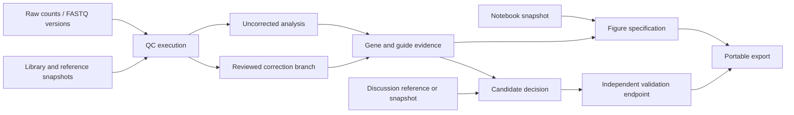

# SplicR as a laboratory evidence workspace

Research and repository review: October 8, 2026. This is a proposed product and research programme, with the small implementation completed in this pass explicitly identified below. It does not establish a new statistical winner, a false biological candidate, or error-free software.

## Decision

Build SplicR around a durable **experiment → run → evidence → decision → validation** record. A lab should be able to answer which measurement, notebook, discussion, settings and reference release produced a figure, download each item, and reproduce the analytical decision without relying on whoever ran the notebook. Scientific differentiation should come from demonstrably better decisions under specific experimental conditions, with uncertainty and failures exposed.

The proposed three-method consensus is useful as a comparison view, but cannot substantiate the advertised superiority claim. Copy-number correction and guide-efficacy modelling are established methods; integration alone is not algorithmic novelty. SplicR can earn a valuable workflow advantage before it earns an algorithmic one.

## Scientific corrections to the supplied blueprint

| Proposed assertion | What the evidence supports | Product consequence |
|---|---|---|
| MAGeCK ignores copy number and treats all guides equally | MAGeCK provides optional CN correction; MLE accepts and can update guide-efficiency estimates. The current SplicR adapter does not expose those CN inputs. | Benchmark against appropriately configured MAGeCK. Identify the actual adapter gap rather than misdescribe the method. |
| An amplified gene is a false positive | Cutting toxicity is a plausible confound, and amplified genes can also have genuine biological effects. | Preserve the measured result, modelled correction, residual and independent validation separately. |
| JACKS learns which guides have off-target toxicity | JACKS models shared efficacy across compatible screens. Efficacy is not a genomic specificity assessment. | Separate efficacy estimates from multi-target alignments and off-target evidence. |
| Three callers agreeing means a gold-tier true hit | Callers see the same reagents and counts and can share systematic error. | Show agreement and eligibility denominators; do not manufacture a consensus probability or FDR. |
| A connected STRING complex proves the biology | STRING distinguishes functional associations and predicted physical relationships; a relationship confidence is not validation of this experiment. | Treat networks as context, retain evidence channels, and avoid circular literature corroboration. |
| Reanalysis proves a paper wrong | A corrected or nonsignificant screen result challenges a specific analytical claim. Target-specific biology needs additional evidence. | Make the exact contested claim, endpoint and validation evidence visible. |

MAGeCK's maintained [usage documentation](https://sourceforge.net/p/mageck/wiki/usage/) describes `--cnv-norm`, `--cell-line`, `--sgrna-efficiency` and `--update-efficiency`. The [MAGeCKFlute protocol](https://www.nature.com/articles/s41596-018-0113-7) describes CN correction and downstream analysis. Neither establishes that a particular SplicR run used those options.

The [CERES study](https://pmc.ncbi.nlm.nih.gov/articles/5709193/) establishes the relevance of cutting toxicity and jointly estimates dependency and reagent activity across a large collection of screens. A hand-written penalty on an amplified gene's MAGeCK score would not be CERES. The [Chronos study](https://link.springer.com/article/10.1186/s13059-021-02540-7) distinguishes its population-dynamics inference from its post-hoc CN correction; the latter requires at least three cell lines in the reported method. Do not construct that cohort by counting three conditions of the same line as three independent genomes.

The [JACKS paper](https://pmc.ncbi.nlm.nih.gov/articles/PMC6396427/) models guide efficacy using screens sharing a library. The [BAGEL2 paper](https://pmc.ncbi.nlm.nih.gov/articles/PMC7789424/) includes a separate multi-target correction and uses CRISPRcleanR for CN-associated bias. These are different correction mechanisms with different required inputs. Bayesian methodology alone does not establish clean FDR control.

### Ferrarone is an important counterexample

Ferrarone's VAC14/FIG4 screen signal is enrichment in LKB1-restored A549 spheroids. The paper also reports follow-up knockouts with multiple guides in A549 and MOR, and pharmacological and resistant-mutant experiments for PIKFYVE. The reasoning must consider those experiments; it cannot stop at a pooled-screen q-value. The cited paper does not establish that VAC14 was an A549 amplified-region dropout artifact. [Ferrarone et al., PNAS 2024](https://pmc.ncbi.nlm.nih.gov/articles/PMC11127050/).

For that study, display EV, LKB1-WT, plasmid and culture factors explicitly. A WT-vs-EV contrast describes a difference between endpoint pools; it is not automatically a genotype-by-culture interaction. A difference of significant/nonsignificant calls is not a significant difference. Estimate the specified interaction in an identifiable model, show its coefficient and uncertainty, and state the role of the single shared plasmid reference. The existing [study audit](../artifacts/ferrarone-20261007/README.md) records the deposited count-table limits and annotation repairs.

## What the checkout actually already has

This is a source review, not a certification of deployed database contents or every browser path.

| Capability | Evidence in the checkout | Remaining gap |
|---|---|---|
| Multiple statistical callers | `engine/splicr/hits.py`: RRA, MLE, BAGEL2 and DrugZ with separate output columns | JACKS/Chronos execution adapters and validated CN-correction paths are absent from the private analysis flow |
| Method eligibility | `pipeline.py` and `private_screen.py` reject unsupported CN/Chronos requests and restrict BAGEL2 to fitness/reference contrasts | A user-facing eligibility report explaining every applicable and unavailable method |
| Guide identity and diagnostics | Keyed `GuideEffect` rows, `guide_effects`, `gene_disagreement`, protein/domain evidence | Sample-level inspectability and a single candidate view across all relevant comparisons |
| Confounder annotations | `artifacts.py`: representation, genomic proximity, multi-target and other evidence | These annotations do not constitute a fitted correction model |
| Reference context | DepMap features, reference lake and STRING/Reactome graph channels | Release-aware model identity, current evidence refresh and transparent coverage in each view |
| Run provenance | Input/count/source hashes in portable reports; run settings/stages/artifacts in database | A complete frozen execution receipt, full environment, exact commands and historical run guarantees |
| Export | CSV ZIP, JSON and styled XLSX, selection settings, keyed guide evidence, dictionary and SHA-256 verifier | Offline figures, notebook/discussion attachments, replay environment and larger export jobs |
| Validation | Endpoint definitions, outcome records and coverage gates | Independently collected outcome cohorts sufficient for a supported probability model |
| Lab organisation | Experiments/screens, reviewed intake, planner and candidate worklists | First-class notebooks, discussions, figure versions, decisions and project-level evidence search |

Do not recreate screens, jobs or guide-result tables blindly: those concepts already exist. Preserve identity and organisation policies when extending them.

### Existing negative results must inform new experiments

The [isoform experiment](../engine/research/isoform/RESULT.md) reports that annotation-only filtering improved separation on 35 of 100 evaluated screens and worsened median NNMD. Its account also reports degradation from tested efficacy-prior weighting despite some predictive correlation. These results concern those priors, screens and separation metrics, not all future probabilistic efficacy models. They are a reason to test a proposed weight, not assume it helps.

The [Millman audit](../artifacts/millman-20261008/output/results_summary.json) reports exact numeric agreement with a standalone run of the same MAGeCK implementation. It also reports no native-directional q≤0.1 discoveries, guide fragility and aggregate-sample limitations. That verifies wiring and highlights evidence worth inspecting; it cannot establish superiority or prove a named candidate false.

The [replication-independence audit](artifacts/20261008/replication_independence.json) checks reuse among archived screen pairs, but has only five publications and strong publication-pipeline concentration. Cross-screen hit agreement is not independent biological validation. An existing public test set does not become untouched when the code is refrozen.

## Method selection should follow the experiment

| Experiment or input | Appropriate first analysis | Optional research branch | Conditions that must be visible |
|---|---|---|---|
| KO fitness endpoint against pDNA/early abundance reference | Native RRA; MLE when the design supports it; BAGEL2 with appropriate reference sets | Matched CN correction, CRISPRcleanR, JACKS, Chronos | Reference identity, negative controls, infection independence, time since infection and adequate reference coverage |
| Drug or isogenic differential fitness | A specified MLE coefficient; DrugZ for suitable chemogenetic designs | Chronos condition comparison where its contract is met | Biological replicate identity, pairing, baseline pools, design rank and direct differential endpoint |
| Positive selection/resistance | Direction-preserving RRA or an appropriate differential model | A benchmarked model for that endpoint | Outgrowth, bottleneck, surviving clone structure and absence of replication |
| Sorted expression/migration/marker assay | A model suitable for its bins and sampling process; retain supported simple contrasts | A purpose-built bin/compositional model | Bin sizes, cell fractions, phenotype definition and selection mechanism |
| CRISPRi or CRISPRa | Modality-appropriate count analysis | Modality-specific efficacy models | No Cas9 DNA-cutting-toxicity correction merely because the tool is called CRISPR |
| Focused library | Count model and robust controls matched to the design | Correction only after explicit coverage checks | Genome-wide segmentation and essentiality training distributions may not be supported |
| Multiplex guides, nonhuman systems, Perturb-seq | Separate input and model contracts | Dedicated methods | A construct is not necessarily one guide/one gene; pooled abundance is not a single-cell phenotype |

These are design recommendations, not a declaration that each optional branch is implemented. The [DrugZ study](https://pmc.ncbi.nlm.nih.gov/articles/PMC6706933/) addresses chemogenetic interactions. The [Chronos repository](https://github.com/broadinstitute/chronos) specifies count orientation, guide maps, reference batches and days, and documents a condition-comparison path requiring independent biological replicates. Its timing examples also rule out a blanket promise that all methods finish in seconds.

### A safe CN-correction implementation

1. Resolve the biological model by stable identity; retain the submitted name, match confidence and whether it is a reference line or an engineered derivative. Never silently substitute a lung-lineage average as the genome of an unknown model.
2. Pin the actual CN source release, file checksum, gene mapping, genomic build and units. DepMap's [24Q2 release](https://forum.depmap.org/t/announcing-the-24q2-release/3312) changed the relative CN matrix to an untransformed scale, and [24Q4](https://forum.depmap.org/t/announcing-the-24q4-release/3564) changed gene-level mapping. A 2021 transformation recipe cannot be applied to every current file. Relative CN is not an absolute integer copy count.
3. Validate an upstream implementation and the exact adapter conversion on a pinned fixture. MAGeCK's CN input contract and Chronos's expected scale are separate contracts. Include neutral, amplified, deleted, missing and malformed values; a missing observation is not a neutral genome.
4. Preserve a complete uncorrected run, then create a correction branch with its own inputs, configuration, version and outputs. Prevent accidental double correction. Corrected transformed counts must be labelled as derived values.
5. For a genome-wide KO screen with guide positions, assess [CRISPRcleanR](https://pmc.ncbi.nlm.nih.gov/articles/PMC6088408/) as a branch that does not require a measured CN profile. Report its genome coverage, segmentation assumptions and any region it could not evaluate.
6. Compare positive/negative control behaviour and matched external validation before promoting the correction. Include amplified true dependencies and condition-specific effects, where excessive correction could discard biology.

The existing DepMap feature name `dm_cn_log2` is a legacy-name hazard: `features/depmap.py` passes its loaded CN values through, while `artifacts.py` correctly documents current `OmicsCNGene` as linear relative CN. Resolve the naming/documentation contract before extending exports or fitting a new model; renaming an established feature requires versioning rather than silently changing trained-model inputs.

### Guide efficacy and specificity

Keep four fields distinct: a learned efficacy estimate; a sequence-based prediction; a genome-alignment specificity assessment; and empirical inconsistency in the current screen. Identify the exact guide sequence, library version, genome build, mapping multiplicity and estimation cohort. Never multiply raw integer counts by a heuristic efficacy score and feed them back to a count caller as though they were observations.

A JACKS branch should share efficacy only across a compatible library/cohort and expose uncertainty and transfer coverage. Historical reference efficacies cannot be assumed available for every newly uploaded library. Screen effects must remain condition-specific. Separate multi-target assessment can evaluate BAGEL2's correction and [CSC](https://www.nature.com/articles/s41467-021-26722-w); compare alignment settings and retain the uncorrected result. Do not infer measured off-target toxicity from a predicted alignment alone.

### Consensus should be inspectable

Use a table with one native effect/statistic per eligible method, an explicit hypothesis/direction, completion status and disagreement. Count agreement only among methods asking the same question. A BAGEL2 Bayes factor, RRA score, MLE coefficient and Chronos growth effect have different meanings and scales.

An exploratory consensus rank can help organise follow-up if its rule is displayed and versioned. It must not be labelled FDR or a probability. Filtering an FDR-controlled discovery list using other data-dependent methods does not automatically preserve its FDR. A calibrated ensemble would need a frozen combination rule and independent labels; its benchmark must also evaluate missed real effects, not just a smaller hit list.

## A plausible original research programme

The following are hypotheses to test, not new successful algorithms.

**Representation-aware uncertainty comes first.** A [2026 study](https://link.springer.com/article/10.1186/s12864-026-12658-2) reports an association between low initial guide representation and more extreme effects, including under Chronos. Its estimated false-positive counts depend on assumptions and are not independent labels. Test whether modelling reference-abundance-dependent noise, rather than hard filtering guides, improves decisions at a matched recall. Sequencing coverage and physical cell coverage are separate quantities.

**Robust efficacy modelling comes next.** Investigate a hierarchical negative-binomial model with library-size offsets, experimental-design effects, guide efficacy informed by an independent compatible cohort, guide-specific deviations and a contamination/outgrowth component. Biological replicate/pool dependence must be modelled rather than treating guides or split aliquots as independent replications. Include reference counts in the likelihood or their uncertainty in the effect model; a fixed denominator is not noiseless.

**CN and structural effects are a separate component.** Learn nuisance effects only where identifiable, and compare a correction branch to a model that includes the nuisance term directly. Sparse focused libraries and a single genome may not identify all proposed components. The [2024 chromosome-truncation study](https://www.nature.com/articles/s41588-024-01758-y) shows why CN alone does not cover every gene-independent phenotype. This is motivation for diagnostics and controls, not permission to declare every chromosome-neighbour cluster false.

An illustrative count contract is `Y[g,s] ~ NB(mu[g,s], alpha[g,s])` with an offset for sample exposure and a predictor containing a guide baseline, the declared design, efficacy-mediated target effects and an eligible nuisance component. This is an initial design, not a fitted or validated model. Efficacy and target effects can trade off; constrain their scale and validate identifiability on simulation before implementation. Do not add all nuisance terms merely because metadata are available, since a nuisance factor collinear with treatment can erase the biological effect.

Required ablations: baseline only; representation variance only; robust-guide component only; CN correction only; independently learned efficacy only; and the combined model. Preserve adverse results and computational cost. A convincing improvement should survive removal of the component that simply encodes the evaluation labels.

## How to earn a superiority claim

Start with a narrow claim, such as improved precision for independently validated KO fitness dependencies at matched recall under low reference representation. Register the task, eligible experiments, endpoints, analysis family, candidate thresholds, primary metric and practical improvement before evaluating final labels.

The [pooled-screen benchmark study](https://pmc.ncbi.nlm.nih.gov/articles/PMC7063732/) distinguishes simulated truth from incompletely known biological truth. Use both, and state the limitation of each. Common-essential separation is a useful diagnostic, but cannot by itself certify condition-specific discovery.

| Benchmark decision | Required implementation |
|---|---|
| Information matching | All callers receive the same allowed counts, reference data and experimental metadata; separately compare any method with extra historical information |
| Competitive baselines | Properly configured RRA/MLE, relevant correction branches, BAGEL2/JACKS/Chronos where eligible, and a simple effect-size baseline |
| Leakage | Split by publication/lab and related biological pool; prohibit target screens and outcome labels in learned guide priors; record library/cell-line overlap |
| Selection | Tune only on development data; freeze source, environment, parameters and prediction hashes before a final independent outcome cohort |
| Biological truth | Independent guides, orthogonal perturbation and target-specific rescue where appropriate; retain indeterminate measurements and endpoint definitions |
| Primary comparison | Paired precision at prespecified recall or recall at prespecified empirical error; report effect and cluster-level uncertainty, not only a p-value |
| Stress cases | Low representation, amplified true dependencies, multi-target guides, mixed guide direction, outgrowth, weak screens and batch-confounded designs |
| Generalisation | Report publication, library, model, modality and phenotype subgroups; a KO-fitness result does not transfer automatically to CRISPRa in vivo |
| Operational value | Run completion, peak memory, time, cost, skipped-method rate and interventions per analysis |
| Claim gate | Prespecified improvement over the strongest eligible baseline with uncertainty supporting it and no unacceptable failure in a critical subgroup |

The required number of studies should follow a power/precision analysis using realistic between-lab variation, not an arbitrary promise that ten screens suffice. With few publications, report the inadequate uncertainty instead of bootstrapping thousands of genes as though they were independent experiments. Have an independent custodian keep the final prediction receipt; a local hash is a content commitment rather than trusted timestamping.

## Challenging a published candidate responsibly

Use an evidence ladder: **reproduced measurement → analytical discrepancy → unresolved confound → independent assay contradiction → target-specific explanation**. Each step has a different claim.

Record the paper's exact candidate, assay, effect direction, model, comparator and validation figures. Reproduce the deposited data/settings as far as available, list differences from the publication, then evaluate prespecified sensitivity branches. Inspect every guide and biological replicate, not just the gene rank. Reanalyse the independent follow-up data if supplied.

Loss of statistical significance is not evidence of absence. To establish a practically negligible effect, an equivalence design needs a prespecified meaningful effect margin and sufficient precision. To attribute a dropout to cutting toxicity, use suitable independent perturbations, molecular confirmation and controls that distinguish DNA damage from target loss. A failed rescue is also ambiguous if the construct was not expressed or functional.

Suitable statements are “the deposited pooled-screen result does not meet this prespecified threshold” or “the candidate is sensitive to guide X and correction Y.” A paper-wide claim requires paper-wide evidence. For Ferrarone, the existing follow-up experiments make a simple amplified-dropout rebuttal especially inappropriate.

## Workspace architecture and organisation

Reuse existing experiment, screen, comparison and run identities. Add versioned evidence objects and typed relations, rather than a folder full of detached URLs. Suggested records:

| Record | Key fields and invariant |
|---|---|
| Artifact version | Organisation, stable artifact ID, version ID, media type, original filename, storage key, size, SHA-256, source identity, ingestion state and licence/export policy |
| Execution attempt | Run ID, unique attempt ID, effective config, exact commands, tool versions, image/environment evidence, seeds, references and stage outputs |
| Evidence relation | Source version, target version, relation (`used`, `generated`, `derived`, `discusses`, `supports`, `contradicts`), creator, timestamp and certainty |
| Notebook snapshot | Original `.ipynb` hash, input versions, environment, kernel and whether execution was independently verified |
| Discussion reference | Provider/workspace/channel/message identity, permalink, access scope, retrieval time and optional permitted snapshot version |
| Decision | Candidate/comparison/run versions, rationale, author, status, reviewed evidence and planned validation endpoint |
| Figure specification | Data artifact hash, method/statistic, comparison, selection, transform, labels, axes, palette, size, renderer version and derived files |

The [W3C PROV model](https://www.w3.org/TR/prov-o/) separates entities, activities and agents. Use that distinction in the evidence graph, and evaluate [Workflow Run RO-Crate](https://www.researchobject.org/workflow-run-crate/) as an interoperable export target. Existing SplicR ZIPs must not be labelled conformant crates until they meet and validate the selected profile.



### Hashes, reruns and storage

A run content identity must commit to raw input bytes, sample-to-file mappings, count canonicalisation, complete effective settings, guide library, references and actual code/environment. Preserve the canonical payload as well as its digest; define and version canonicalisation rather than assuming Python/JavaScript JSON serialization is identical. Display name, UI order and timestamps should not change scientific identity. Random seeds, selected coefficients and reference releases must change it.

A single input/config hash does not freeze the data or establish authorship. Store artifacts under non-overwriting version keys, use append-only execution receipts and prevent normal clients from changing final receipts. Each retry gets an attempt identity. Preserve previous results when a new run becomes current; inspect existing replacement/deletion code before calling history immutable. Record administrative repair/deletion explicitly. Distinguish tamper evidence from tamper prevention and from byte-for-byte numerical reproducibility.

Keep compact candidate/guide records hot in Postgres, scoped to organisation/run/comparison; keep large FASTQ, count matrices and reference snapshots in object storage or the existing Parquet/DuckDB lake. The checked export reader currently caps guide evidence at 120,000 rows and total rows at 300,000, so multi-comparison genome-wide bundles need asynchronous export jobs with streaming rather than silent truncation. Read a frozen run snapshot to prevent mixed-version pagination.

Enforce organisation access for both nodes and edges; a permitted figure must not expose an otherwise private notebook or discussion. Supabase [RLS documentation](https://supabase.com/docs/guides/database/postgres/row-level-security) supports database row policy enforcement, but object-download authorisation and connector permissions need their own checks. A persisted short-lived signed URL is not a durable artifact identity.

### Slack and Jupyter integration

Start with manually attached discussion permalinks and notebook files, then add explicit connector-backed capture. Slack's [permalink method](https://docs.slack.dev/reference/methods/chat.getPermalink/) provides message links; [history access](https://docs.slack.dev/reference/methods/conversations.history/) depends on scopes and conversation membership, with rate limits that vary by application distribution. A link is not a content snapshot, and a snapshot is not permission to share that discussion with the whole lab. Preserve edited/deleted/inaccessible state and make snapshot/export scope deliberate. Do not silently message channels or import an entire Slack workspace.

Treat notebooks as original versioned artifacts with safe previews. The [Jupyter notebook format](https://nbformat.readthedocs.io/en/latest/format_description.html) records cells, outputs, metadata and execution counts; these fields alone do not prove a clean, ordered execution. Offer a verified “run from a fresh kernel” branch in an isolated environment with pinned inputs. Preserve the original notebook; report execution errors and unavailable dependencies. Never execute an uploaded notebook during ingestion merely to produce a preview.

## Dashboard: make the next experimental decision easy

The primary view should show the project's active experiments, recent runs, unresolved QC/design problems, pinned decisions and upcoming validations. Offer a scientist view for interpretation and an analyst view for execution detail, with both attached to the same records.

A candidate opens a view with five connected panels:

1. **Measurement:** effect, direction, native statistic, hypothesis, threshold, comparator and QC; show method disagreement without collapsing it.
2. **Reagents:** labelled guide waterfall, sample/reference counts, replicate-specific effects, guide sequence/target evidence and representation. Allow each guide row to open its raw measurement. Show “largest absolute guide-LFC share,” not “percentage of causal evidence.”
3. **Sensitivity:** original and corrected results, drop-one-guide effect diagnostics and genuine caller reruns where available. Existing descriptive leave-one-out mean threshold checks must not be relabelled leave-one-out MAGeCK FDR tests.
4. **Context:** DepMap model/lineage, release, numerator/denominator and unavailable coverage; show common-essential context without removing a potential differential effect. Include functional and physical network modes with evidence channels. Use a readable 2D graph by default; optional 3D must preserve accessible tables and selected-node labels.
5. **Decision:** linked notebook/figure/discussion versions, current rationale, owner and endpoint-specific validation. A negative assay and an unresolved assay have different states.

Each plot, table, settings record and original attachment needs an individual download that carries identity and a small metadata sidecar. Figure axes must identify the actual statistic; `-log10(p)` and `-log10(q)` are different plots. For zeros, retain the stored zero and mark the display floor. Do not render missing significance as zero, or invent PCA from a gene summary without an appropriate sample matrix.

Network context should use version-pinned endpoints and cached response bytes. STRING's [API documentation](https://en.string-db.org/help/api/) distinguishes network types and stable version addresses. Its [score documentation](https://string-db.org/help/scores/) distinguishes relationship confidence from interaction strength. If significance of network coherence is tested, prespecify a background from the measured library, control degree/annotation biases where appropriate, and keep text-mining evidence from the challenged paper visible.

### Useful enjoyable features

“What changed?” compares two run receipts and highlights changed inputs, settings, references and affected candidates. “Gene detective” opens one investigation with all guide measurements and decisions. A journal-club view steps through evidence and counterevidence with cited figures. A figure studio saves restrained publication styles and lab presets. A handoff card records what the departing analyst did, what remains unresolved and how to rerun it. Keyboard search and pinned investigation boards make the workspace quick to use. Recognition should reward reproducible deposits and resolved decisions, never inflated hit counts.

## Export contract

A paper bundle should eventually contain these individually useful objects, with selected/omitted/unavailable status recorded:

```text
README.md                         interpretation and replay instructions
manifest.json                     inventories, identities, scope and SHA-256
verify-bundle.py                   offline byte verification
data-dictionary.csv               units, null meaning and statistic definitions
results_methods.csv               native method outputs, joined by comparison
results_consensus.csv              optional descriptive rank; no invented FDR
guide_results.csv                 keyed measurements and annotation provenance
sample_metadata.csv               pools, roles, factors, times, pairing
qc.json                           original metrics and limitations
analysis-settings.json            requested and effective settings, separately
methods-record.json               execution evidence and missing fields
methods_text.txt                  reviewed draft derived from that evidence
figures/*.svg, *.pdf              fixed figure versions with editable labels
figures/*_data.csv, *_spec.json    underlying data and plotting specification
volcano_interactive.html           fully embedded scripts/data for offline use
lineage.json                       versioned entities/activities/relations
notebooks/                        originals plus optional verified execution
discussions/                      only authorised selected snapshots
environment/                      locks, image evidence and replay commands
```

Use self-contained HTML with an embedded pinned plotting runtime, not a CDN URL that fails offline. Escape labels and JSON embedding so a gene/file name cannot become executable markup. Preserve the full selected data behind fast rendering or sampling. SVG/PDF fonts, aspect ratio, colour, point density and label overlap need rendered review; high DPI alone does not make a figure publication-ready. Include the exact selection and renderer versions. Licence-restricted references may need manifests/retrieval instructions rather than redistribution.

Generate methods text deterministically from executed stage evidence. Requested BAGEL2 is not executed BAGEL2. Never invent a container digest, reference release, median-ratio formula or version number. A prose draft with unresolved provenance remains a draft.

## Compute architecture

Extend the existing Modal runner with method adapters declaring their input contracts, eligibility checks and output semantics. Reuse a shared immutable count/library snapshot, then fan out only independent branches. A corrected-count caller depends on correction completion. Put method failures, retries, resource usage and skip reasons in their own stage records; never convert a failed method to a successful empty table.

Use separate pinned environments where upstream dependencies conflict; shared preprocessing does not require a separate container for every trivial operation. Record actual installed versions and source commits, not only intended pins. Modal's [image documentation](https://modal.com/docs/guide/images) recommends tight dependency pinning and supports function-specific environments. Measure runtime, memory and cost on representative inputs before promising turnaround. Bound fan-out and API access rather than issuing thousands of simultaneous STRING/reference requests.

## Implementation order and acceptance gates

| Order | Work package | Acceptance gate |
|---|---|---|
| 1 | Effective execution records, individual artifact identities and export methods evidence | Unknowns remain unknown; requested/skipped methods never become executed; historical outputs survive reruns |
| 2 | Candidate view linking guide/sample measurements, comparisons and decisions | Every displayed number resolves to a recorded run/comparison/guide; QC and missing evidence stay visible |
| 3 | Figure studio and offline bundle | Offline opening and data selection match; SVG/PDF render inspection; all downloads verify independently |
| 4 | Notebook snapshots and permission-scoped discussion links | No automatic code execution; no access widening; version/edited/deleted states are explicit |
| 5 | Eligible CN and JACKS research branches | Exact upstream replay, correct units/library identity, before/after evidence and no double correction |
| 6 | Representation-aware model and validated combination | Frozen benchmark and independent endpoint-specific improvement over strongest eligible baselines |

## Completed in this pass

The CSV ZIP export now adds `methods_text.txt` and `methods-record.json` when Run provenance is selected. Methods come from a unique completed `hits` stage. Requested settings, effective parameters, export filtering, QC, engine revision and missing tool/container evidence are distinct. Both new files enter the existing SHA-256 inventory. The methods record does not infer a caller from non-null result columns.

The pipeline now records its resolved MLE design/seed, actual DrugZ options and control-normalisation guide-list hash/count in the completed hit stage, when those methods were run. This improves future execution evidence; it does not retrofit historical runs or deploy a cloud change.

Validation results are recorded in [the verification note](artifacts/20261008/lab-workspace-verification.md). This pass does not implement JACKS/Chronos adapters, CN correction, Slack integration, notebook replay or the complete figure bundle. Those remain the specified work packages above. Existing worktree changes were preserved.
